 
## 查看主页获取源码

### 一、作品包含

源码+数据库+设计文档千字+全套环境和工具资源+部署教程

### 二、项目技术

前端技术：Html、Css、Js、Vue、Element-ui

数据库：MySQL

后端技术：Java、Spring Boot、MyBatis

  

### 三、运行环境

开发工具：IDEA/eclipse

数据库：MySQL8.0

数据库管理工具：Navicat10以上版本

环境配置软件： JDK1.8+Maven3.6.3

前端Nodejs：16

### 四、项目介绍
项目编号：springbootA350

在当今数字化高速发展的时代，学生信息管理系统应运而生。随着教育规模的不断扩大和教育理念的不断更新，学校对于学生信息的管理要求也日益提高。传统的纸质记录和人工管理方式已无法满足高效、准确地处理大量学生信息的需求。学生信息管理系统以先进的信息技术为依托，旨在为学校提供一个全面、便捷、高效的学生信息管理平台，同时也为学生提供更加便捷的信息查询。

系统分为管理员、老师、学生。
管理员的功能：登录、管理员首页、学生管理、教师管理、课程管理、开课表管理、成绩管理。
老师的功能：登录、首页、个人中心、课程设置、成绩管理。
学生的功能：登录、首页、个人中心、选课管理、学生成绩管理。

### 五、运行截图

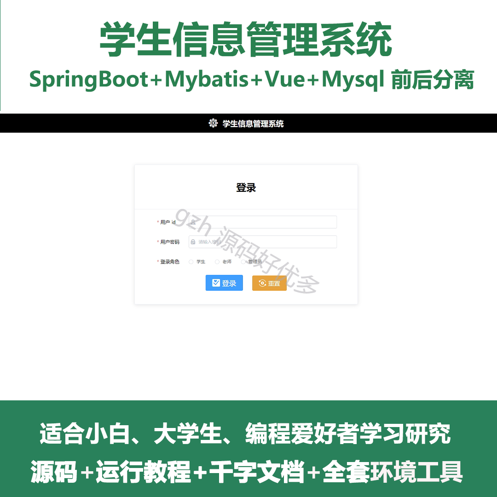
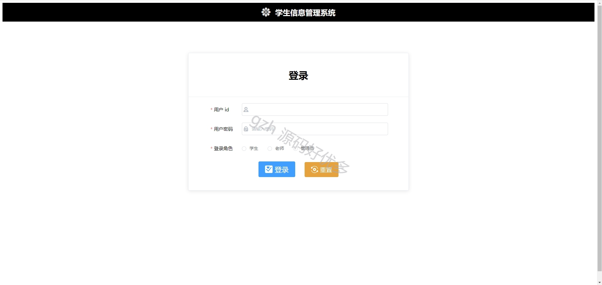
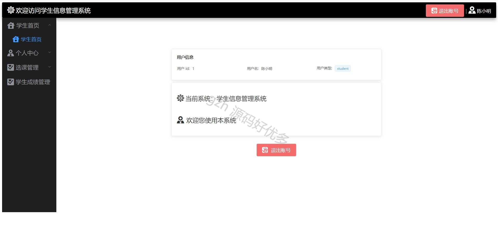
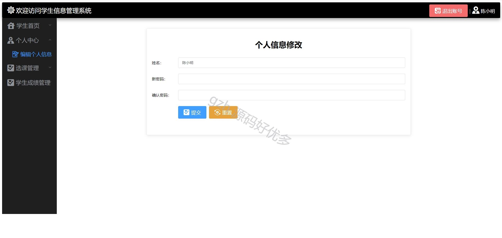
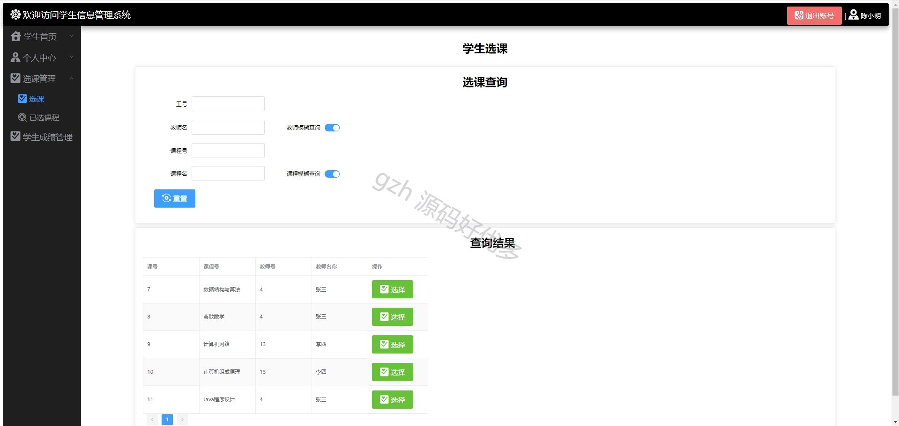
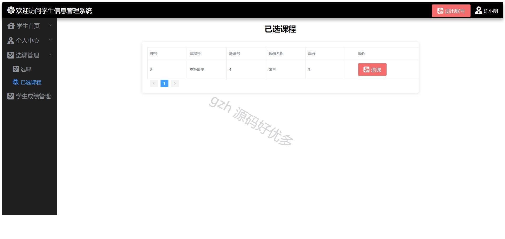
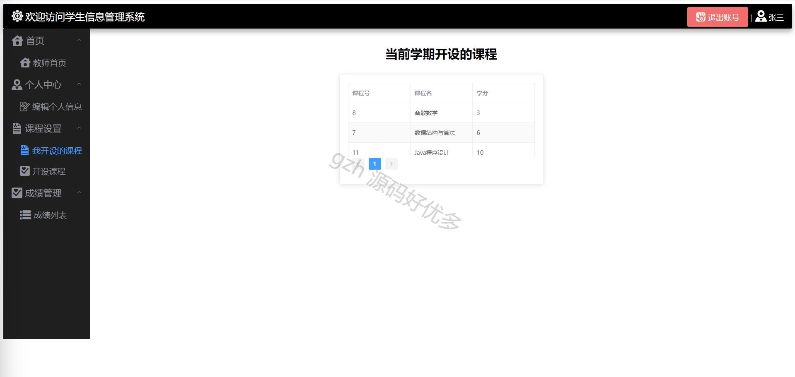
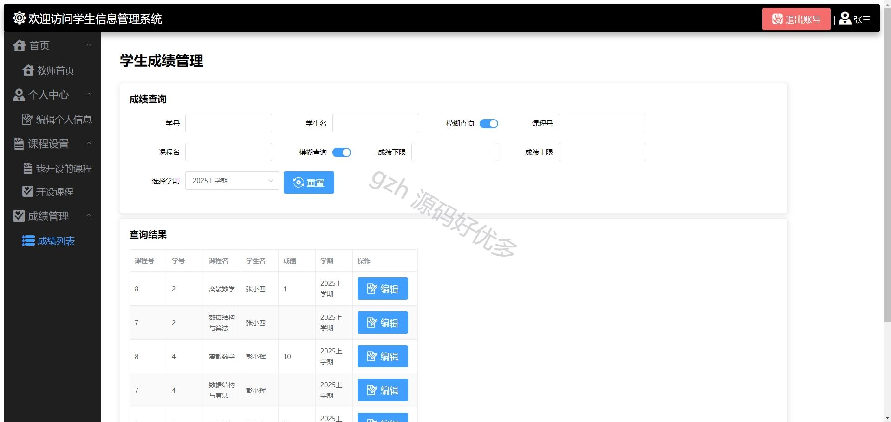
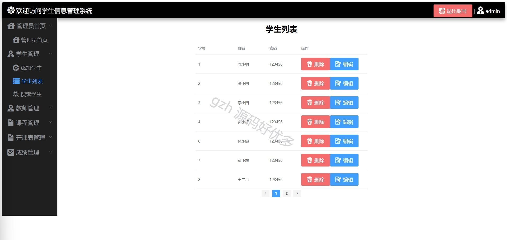
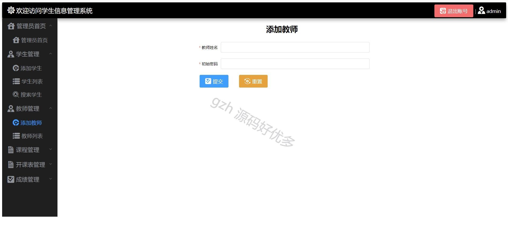
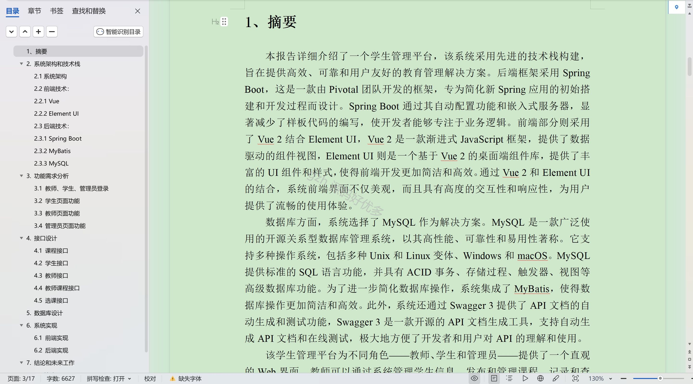

  
